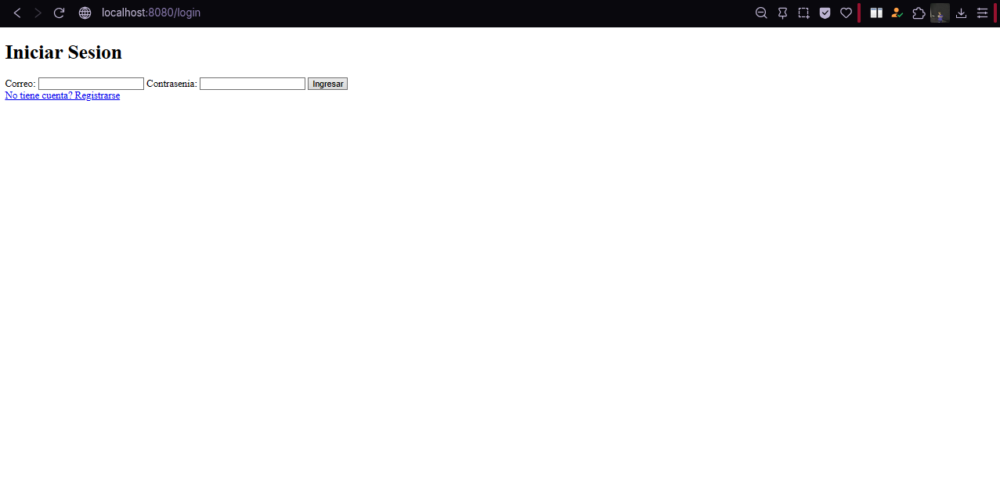
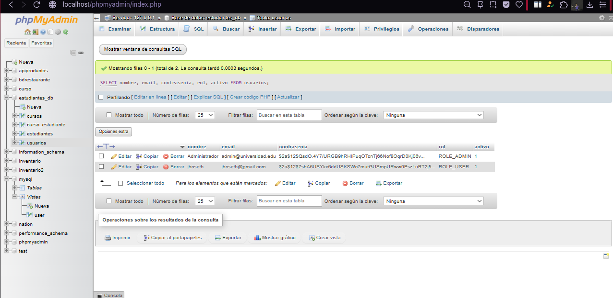
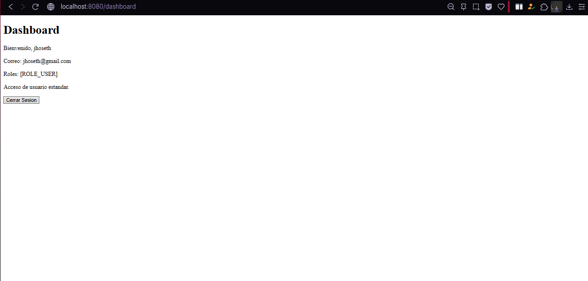
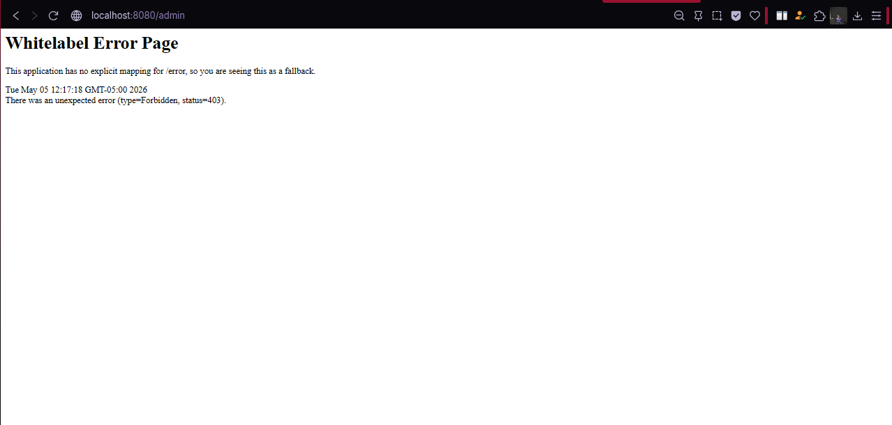
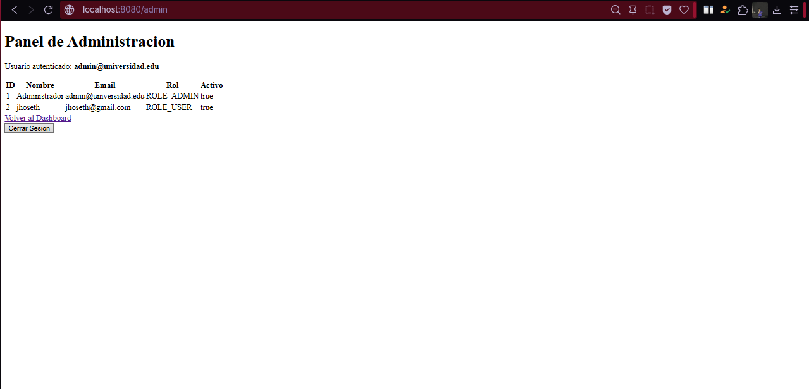

# Seguridad en Aplicaciones Web - Spring Boot + Spring Security 6 + MySQL

## Autor

- **Nombre:** Jhoseth Esneider Rozo Carrillo
- **Codigo:** 02230131027
- **Programa:** Ingenieria de Sistemas
- **Unidad:** 9 Seguridad en Aplicaciones Web
- **Actividad:** Post-Contenido 1
- **Fecha:** 05/05/2026

---

## Descripcion del Proyecto

Este proyecto toma como base el Post-Contenido de la Unidad 8 con Spring Boot, JPA, Thymeleaf y MySQL, y agrega un sistema de autenticacion completo con Spring Security 6.

El sistema permite registrar usuarios con contrasenias hasheadas mediante `BCryptPasswordEncoder`, iniciar sesion con formulario personalizado, autenticar contra MySQL usando `UserDetailsService` y controlar el acceso por roles `ADMIN` y `USER`.

### Funcionalidades Implementadas

**Post-Contenido 1 - Unidad 9:**

- Dependencias `spring-boot-starter-security` y `thymeleaf-extras-springsecurity6`.
- Entidad `Usuario` mapeada a la tabla `usuarios`.
- Registro de usuarios con BCrypt y rol por defecto `ROLE_USER`.
- Login personalizado en `/login`.
- Autenticacion por email consultando MySQL con `UsuarioDetailsService`.
- Dashboard protegido en `/dashboard`.
- Panel de administracion protegido en `/admin`, disponible solo para `ROLE_ADMIN`.
- Logout con invalidacion de sesion y eliminacion de cookie `JSESSIONID`.

---

## Tecnologias Utilizadas

- **Spring Boot 3.2.5**: Framework principal
- **Spring Security 6**: Autenticacion, autorizacion y logout
- **Spring Data JPA**: Acceso a datos
- **Hibernate 6.4.4**: Proveedor ORM
- **MySQL 8.x**: Base de datos relacional
- **Thymeleaf 3.1.2**: Motor de plantillas
- **Thymeleaf Extras Spring Security 6**: Control de vistas por rol
- **Jakarta Validation 3.0.2**: Validacion de formularios
- **Java 17**: Lenguaje de programacion
- **Maven 3.x**: Gestor de dependencias

---

## Estructura del Proyecto

- src/main/java/com/universidad/estudiantes/
- ├── EstudiantesApplication.java
- ├── config/
- │ └── SecurityConfig.java -> SecurityFilterChain, BCrypt y reglas por rol
- ├── controller/
- │ ├── AuthController.java -> Login, registro, dashboard y panel admin
- │ ├── EstudianteController.java -> CRUD Estudiantes de Unidad 8
- │ └── CursoController.java -> Cursos e inscripciones de Unidad 8
- ├── model/
- │ ├── Usuario.java -> Entidad de autenticacion
- │ ├── Estudiante.java
- │ └── Curso.java
- ├── repository/
- │ ├── UsuarioRepository.java -> Busqueda por email
- │ ├── EstudianteRepository.java
- │ └── CursoRepository.java
- └── service/
- ├── UsuarioService.java -> Registro con BCrypt y listado de usuarios
- ├── UsuarioDetailsService.java -> UserDetailsService contra MySQL
- ├── EstudianteService.java
- └── CursoService.java

- src/main/resources/
- ├── application.properties -> Configuracion MySQL y JPA
- └── templates/
- ├── auth/
- │ ├── login.html -> Formulario personalizado
- │ └── registro.html -> Registro de usuarios
- ├── admin/
- │ └── panel.html -> Lista de usuarios, solo ADMIN
- └── dashboard.html -> Vista protegida por autenticacion

---

## Configuracion de la Base de Datos

### 1. Crear Base de Datos en MySQL

Ejecuta estos comandos en MySQL:

```bash
mysql -u root -p
```

Dentro de MySQL ejecutar:

```sql
CREATE DATABASE estudiantes_db CHARACTER SET utf8mb4 COLLATE utf8mb4_unicode_ci;
CREATE USER 'appuser'@'localhost' IDENTIFIED BY 'apppass';
GRANT ALL PRIVILEGES ON estudiantes_db.* TO 'appuser'@'localhost';
FLUSH PRIVILEGES;
EXIT;
```

### 2. Configurar application.properties

```properties
spring.datasource.url=jdbc:mysql://localhost:3306/estudiantes_db?useSSL=false&serverTimezone=UTC
spring.datasource.username=appuser
spring.datasource.password=apppass
spring.datasource.driver-class-name=com.mysql.cj.jdbc.Driver

spring.jpa.hibernate.ddl-auto=update
spring.jpa.show-sql=true
spring.jpa.properties.hibernate.format_sql=true
spring.jpa.database-platform=org.hibernate.dialect.MySQL8Dialect

server.port=8080
```

---

## Instrucciones de Ejecucion

### 1. Ingresar a MySQL o MariaDB

```bash
C:\xampp\mysql\bin\mysql.exe -u root -p
```

### 2. Ejecutar la aplicacion

En PowerShell, en la carpeta del proyecto:

```bash
cd "C:\Users\Public\Dev\estudiantes"
.\mvnw.cmd spring-boot:run
```

Espera a ver en consola:

```text
Started EstudiantesApplication in X.XXX seconds
```

### 3. Acceder a la aplicacion

- Login: http://localhost:8080/login
- Registro: http://localhost:8080/registro
- Dashboard: http://localhost:8080/dashboard
- Panel ADMIN: http://localhost:8080/admin

---

## Usuario ADMIN de Prueba

Para probar el rol ADMIN, primero ejecuta la aplicacion para que Hibernate cree la tabla `usuarios`. Luego inserta manualmente este usuario en MySQL.

La contrasenia en texto claro para la prueba es:

```text
admin123
```

Inserta el usuario ADMIN con un hash BCrypt de `admin123`:

```sql
INSERT INTO usuarios (nombre, email, contrasenia, rol, activo)
VALUES (
  'Administrador',
  'admin@universidad.edu',
  '$2a$12$QsdO.4Y7/URGB9hRHIPuqOTcnTj66Nof8OqrD0Kj06vX4LS6o9P6i',
  'ROLE_ADMIN',
  1
);
```

Usuarios de prueba:

- **ADMIN:** admin@universidad.edu / admin123
- **USER:** registrar desde `/registro` con cualquier correo y contrasenia.

---

## CHECKPOINTS DE VERIFICACION

### Checkpoint 1

- Ejecutar la aplicacion sin errores.
- Abrir http://localhost:8080/dashboard.
- Verificar que Spring Security redirige automaticamente a `/login`.
- Confirmar que aparece el formulario personalizado, no el login por defecto de Spring.

### Checkpoint 2

- Abrir http://localhost:8080/registro.
- Registrar un nuevo usuario con rol por defecto `ROLE_USER`.
- Verificar en MySQL que la contrasenia guardada comienza por `$2a$12$`:

```sql
SELECT nombre, email, contrasenia, rol, activo FROM usuarios;
```

- Iniciar sesion con el usuario registrado.
- Confirmar que `/dashboard` muestra el nombre del usuario.
- Intentar abrir http://localhost:8080/admin con el usuario USER.
- Verificar que Spring Security muestra `403 Forbidden`.

### Checkpoint 3

- Iniciar sesion como `admin@universidad.edu` con contrasenia `admin123`.
- Abrir http://localhost:8080/admin.
- Verificar que se muestra la lista de usuarios.
- Cerrar sesion con el boton `Cerrar Sesion`.
- Verificar que redirige a `/login?logout`.
- Intentar abrir http://localhost:8080/dashboard despues del logout y confirmar que redirige a `/login`.

---

## Capturas de Pantalla

Las siguientes capturas se encuentran en la carpeta `/evidencias/`:

# App corriendo con formulario login



## Consulta MySQL mostrando contraseñaa BCrypt



## dashboard de usuario



## error 403 al entrar a `/admin` como USER



## Panel ADMIN con lista de usuarios



---

## Conceptos Clave Implementados

### BCryptPasswordEncoder

```java
@Bean
public PasswordEncoder passwordEncoder() {
    return new BCryptPasswordEncoder(12);
}
```

### UserDetailsService contra MySQL

```java
Usuario u = repo.findByEmail(email)
    .orElseThrow(() -> new UsernameNotFoundException(
        "Usuario no encontrado: " + email));
```

### Rutas Protegidas por Rol

```java
.requestMatchers("/admin/**", "/admin").hasRole("ADMIN")
.anyRequest().authenticated()
```
